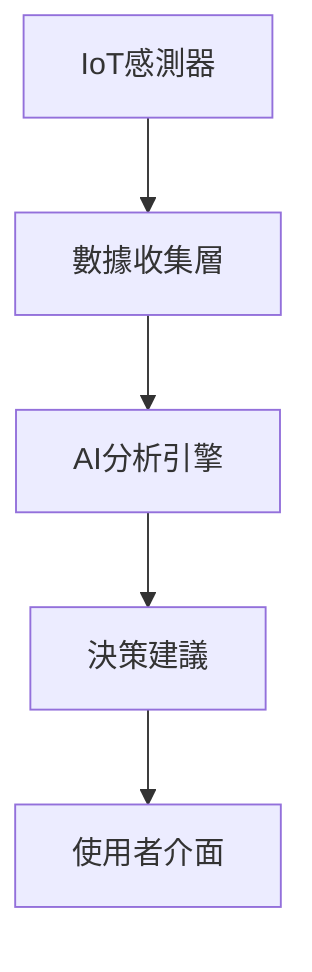

# AI 驅動的智慧農業：領頭羊博士開發實錄

## 前言

在傳統農牧業中，數據管理與決策往往依賴經驗。本文將分享我如何透過 AI 技術，為農牧業帶來數位轉型。

## 技術架構

### 核心技術

- **Google Gemini AI**：自然語言處理與智慧決策
- **IoT 感測器網路**：環境數據即時收集
- **可驗證帳本**：確保數據完整性與可追溯性
- **Flask + Vue 3**：全端應用架構

### 系統流程

## 遇到的挑戰

1. **感測器數據清洗**：不穩定的訊號需要智慧濾波
2. **AI 回應延遲**：優化 API 呼叫策略
3. **離線場景**：邊緣運算解決方案

## 成果與展望

系統成功部署後，協助農戶減少 30% 的人力成本，提升 20% 的產能效率。

---

*如果您對智慧農業有興趣，歡迎[聯繫我](/contact)討論！*
